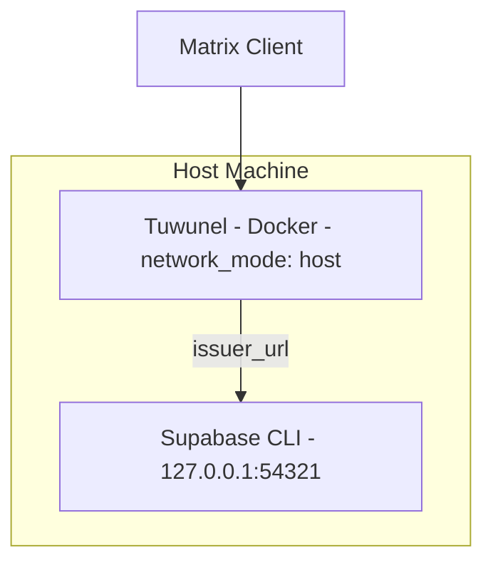

# Local Development Setup (Tuwunel + Supabase OAuth 2.1)

This document explains how to run the full stack locally:

- Tuwunel (Matrix homeserver)
- Supabase (local CLI instance)
- Element Web (Matrix client)

---

# Architecture Overview



Since Tuwunel runs with `network_mode: host` (defined in `tuwunel/docker-compose.dev.yml`), the container shares the host network stack. This means Tuwunel can reach Supabase directly at `127.0.0.1:54321` without any tunnel or extra networking configuration.

---

# 1. Start Supabase Locally

From the Supabase project directory:

```bash
supabase start
```

Verify it is running:

```bash
supabase status
```

Supabase Auth will be available at:

```
http://127.0.0.1:54321/auth/v1
```

---

# 2. Verify Discovery Endpoint

Supabase CLI exposes an OpenID Connect discovery endpoint by default. Verify it:

```bash
curl http://127.0.0.1:54321/auth/v1/.well-known/openid-configuration
```

The response must contain:

```json
{
  "issuer": "http://127.0.0.1:54321/auth/v1"
}
```

This `issuer` value is what Tuwunel uses to validate tokens. It must match `issuer_url` in `tuwunel/tuwunel.toml` exactly.

---

# 3. Configure Tuwunel Secrets

Copy the secret template and add your OAuth client secret:

```bash
cd tuwunel
cp .client_secret.example .client_secret
```

Edit `tuwunel/.client_secret` with your Supabase OAuth client secret (the raw value, no quotes or newlines).

The `client_id` is already configured in `tuwunel/tuwunel.toml`. Tuwunel reads the secret from the file path specified by `client_secret_file` in the TOML config.

> [!IMPORTANT]
> `issuer_url` in `tuwunel/tuwunel.toml` must match the `issuer` returned by `/.well-known/openid-configuration`. No mixing of `localhost` vs `127.0.0.1`, or adding/removing trailing slashes unless the discovery response includes them.

---

# 4. Start the Stack

Start Tuwunel and Element Web separately.

**Tuwunel:**

```bash
cd tuwunel
docker compose -f docker-compose.yml -f docker-compose.dev.yml up -d
```

Tuwunel runs on port `8008`.

**Element Web:**

```bash
cd element
docker compose -f docker-compose.yml -f docker-compose.dev.yml up -d
```

Element Web runs on port `8080`.

---

# 5. Docker Networking

Tuwunel runs inside Docker with `network_mode: host` (configured in `tuwunel/docker-compose.dev.yml`). This means the container shares the host's network directly:

- Tuwunel can reach Supabase at `127.0.0.1:54321` -- no tunnel or DNS workaround needed.
- No `extra_hosts` or `host.docker.internal` configuration is required.

> [!NOTE]
> `network_mode: host` is a Linux-only Docker feature. On macOS or Windows (Docker Desktop), you may need to use `host.docker.internal` instead of `127.0.0.1` in the issuer URL, and adjust the Supabase config accordingly.

---

# 6. Common Local Mistakes

## Issuer Mismatch

```
Configured issuer_url does not match discovered issuer
```

Caused by using `localhost` instead of `127.0.0.1`, a missing `/auth/v1` path, or a trailing slash difference. The match must be exact against the value returned by the discovery endpoint.

---

## Invalid Redirect URI

```
400 invalid_redirect_uri
```

The callback registered in Supabase must match exactly:

```
http://localhost:8008/_matrix/client/unstable/login/sso/callback/<CLIENT_ID>
```

---

## Wrong Token Authentication Method

```
invalid authentication method
```

The OAuth client must be registered with `client_secret_post`. See `supabase-oauth.md` for the full SSO flow and registration details.

---

# 7. Verifying the Full Local Flow

Open in a browser:

```
http://localhost:8008/_matrix/client/v3/login/sso/redirect?provider=<CLIENT_ID>&redirectUrl=http://localhost:8008
```

Authenticate in Supabase. After consent, you should land on:

```
http://localhost:8008/?loginToken=...
```

If `loginToken` appears in the URL, the OAuth exchange succeeded. See `supabase-oauth.md` for a detailed breakdown of each step.

---

# Production

In production, each component is deployed separately:

| Component                       | Platform                                                     | Notes                                                 |
| ------------------------------- | ------------------------------------------------------------ | ----------------------------------------------------- |
| **Tuwunel** (Matrix homeserver) | Railway or any Docker-capable platform                       | Uses `tuwunel.prod.toml` + `.client_secret`           |
| **Element Web** (Matrix client) | Any static hosting (Vercel, Netlify, Cloudflare Pages, etc.) | Static SPA -- just HTML/CSS/JS served by a web server |
| **Supabase** (Auth provider)    | Supabase Cloud                                               | Hosted at `https://<project-ref>.supabase.co`         |

Key differences from local:

- `issuer_url` changes to `https://<project-ref>.supabase.co/auth/v1/`
- Tuwunel uses a real domain with HTTPS (e.g. `https://connect.soundadvice.club`)
- Element's `config.prod.json` points to the Tuwunel production URL
- OAuth redirect URIs must be updated in Supabase for the production domain
- The OAuth client should be recreated in Supabase Cloud with production credentials
