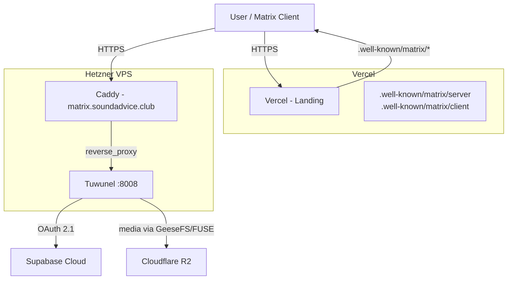

# Production Setup (Tuwunel + Caddy on Hetzner VPS)

This document covers the full production deployment of Tuwunel on a shared VPS from Hetzner, using Caddy as a reverse proxy with automatic HTTPS.

---

## Architecture Overview



| Component         | Platform       | Notes                                                   |
| ----------------- | -------------- | ------------------------------------------------------- |
| **Tuwunel**       | Hetzner VPS    | Native `.deb` install, managed by systemd               |
| **Caddy**         | Hetzner VPS    | Reverse proxy with automatic TLS                        |
| **Supabase**      | Supabase Cloud | OAuth 2.1 / OpenID Connect provider                     |
| **Media storage** | Cloudflare R2  | Mounted via GeeseFS (FUSE), managed by systemd          |
| **DNS**           | Vercel         | `matrix` A record pointing to the VPS public IP         |
| **.well-known**   | Vercel         | Matrix delegation files served from the landing project |

---

## Prerequisites

- A shared VPS on Hetzner (aarch64)
- A domain with DNS managed by Vercel (or any DNS provider)
- A Supabase Cloud project with an OAuth App created
- A Cloudflare account with R2 enabled (for media storage)

---

## 1. Provision the VPS

Create a shared VPS on Hetzner. During creation, add an SSH key so you can access the server without a password.

Connect via SSH:

```bash
ssh root@<VPS_IP>
```

Update the system:

```bash
apt update && apt upgrade -y
```

---

## 2. Create System User and Directories

Create a dedicated system user for Tuwunel (no login shell, no home directory):

```bash
useradd -r --shell /usr/bin/nologin --no-create-home tuwunel
```

Create the data and configuration directories:

```bash
mkdir -p /var/lib/tuwunel/
chown -R tuwunel:tuwunel /var/lib/tuwunel/
chmod 700 /var/lib/tuwunel/
mkdir -p /etc/tuwunel
```

---

## 3. Install Tuwunel

Download the latest `.deb` release for aarch64 and install it:

```bash
wget https://github.com/matrix-construct/tuwunel/releases/download/v1.5.0/v1.5.0-release-all-aarch64-v8-linux-gnu-tuwunel.deb -O tuwunel.deb
dpkg -i tuwunel.deb
```

Verify the installation:

```bash
tuwunel --version
```

---

## 4. Configure Supabase OAuth

### Enable JWT Signing Keys

Supabase Cloud does not generate JWKS keys by default. Without them, Tuwunel cannot validate ID tokens and the SSO flow will fail with a 500 error after an otherwise successful authorization.

In the Supabase Dashboard, go to **Project Settings > JWT Keys** and enable JWT signing keys.

Verify that keys are available:

```bash
curl https://<PROJECT_REF>.supabase.co/auth/v1/.well-known/jwks.json
```

The response must contain a non-empty `keys` array. If you see `{"keys": []}`, signing keys are not enabled yet.

> [!WARNING]
> This issue only surfaces in production with Supabase Cloud. Locally, Supabase CLI auto-generates JWKS keys automatically.

### Create OAuth Client via API

Tuwunel only supports `token_endpoint_auth_method = client_secret_post` for the token exchange. As of this writing, the Supabase Dashboard does not expose this option -- OAuth clients created through the UI default to `client_secret_basic`, which Tuwunel does not support and will result in a `400 Bad Request` on the `/oauth/token` endpoint.

The OAuth client must be created via the Supabase Admin API instead.

The **Service Role API Key** is found in: **Supabase Dashboard > Project Settings > API > `service_role` key** (keep this secret).

**List existing OAuth clients:**

```bash
curl --request GET \
  --url https://<PROJECT_REF>.supabase.co/auth/v1/admin/oauth/clients \
  --header 'apikey: <SERVICE_ROLE_KEY>' \
  --header 'authorization: Bearer <SERVICE_ROLE_KEY>'
```

**Create a new confidential client with `client_secret_post`:**

```bash
curl --request POST \
  --url https://<PROJECT_REF>.supabase.co/auth/v1/admin/oauth/clients \
  --header 'apikey: <SERVICE_ROLE_KEY>' \
  --header 'authorization: Bearer <SERVICE_ROLE_KEY>' \
  --header 'content-type: application/json' \
  --data '{
    "client_type": "confidential",
    "redirect_uris": [
      "https://matrix.soundadvice.club/_matrix/client/unstable/login/sso/callback/<CLIENT_ID>"
    ],
    "token_endpoint_auth_method": "client_secret_post",
    "grant_types": ["authorization_code", "refresh_token"],
    "response_types": ["code"],
    "client_name": "Connect"
  }'
```

The response contains the generated `client_id` and `client_secret`.

> [!IMPORTANT]
> The `redirect_uris` path includes the `client_id`. After creating the client, note the `client_id` from the response and update the redirect URI if needed using a PUT request to the same endpoint with the client ID appended (e.g. `.../admin/oauth/clients/<CLIENT_ID>`).

> [!IMPORTANT]
> The `client_id` from this response is what goes into the Tuwunel identity provider config (`client_id`, `callback_url`) and into `/etc/tuwunel/.client_secret` for the secret.

### Save the Client Secret

```bash
echo -n "SECRET_FROM_RESPONSE" > /etc/tuwunel/.client_secret
```

Lock down permissions:

```bash
chmod 600 /etc/tuwunel/.client_secret
chown tuwunel:tuwunel /etc/tuwunel/.client_secret
```

---

## 5. Configure Tuwunel

Create the configuration file:

```bash
vi /etc/tuwunel/tuwunel.toml
```

Full configuration:

```toml
[global]
server_name = "soundadvice.club"
database_path = "/var/lib/tuwunel"
address = ["0.0.0.0"]
port = 8008
allow_registration = false
allow_encryption = true
grant_admin_to_first_user = true
new_user_displayname_suffix = ""
max_request_size = 2147483648  # 2GB
# Prevents users from creating rooms (admins can always create rooms)
allow_room_creation = false
block_non_admin_invites = true
# No federation
allow_federation = false
allow_public_room_directory_over_federation = false
allow_inbound_profile_lookup_federation_requests = false
auto_join_rooms = [
    "#announcements:soundadvice.club",
    "#events:soundadvice.club",
    "#general:soundadvice.club",
]
access_control_allow_origin = [
    "https://connect.soundadvice.club",
    "https://app.soundadvice.club"
]

[global.well_known]
client = "https://matrix.soundadvice.club"
server = "matrix.soundadvice.club:443"

[[global.identity_provider]]
brand = "SoundAdvice"
client_id = "<SUPABASE_OAUTH_CLIENT_ID>"
client_secret_file = "/etc/tuwunel/.client_secret"
issuer_url = "https://xotpctnbcmgkwmiplesn.supabase.co/auth/v1"
discovery_url = "https://xotpctnbcmgkwmiplesn.supabase.co/auth/v1/.well-known/openid-configuration"
callback_url = "https://matrix.soundadvice.club/_matrix/client/unstable/login/sso/callback/<SUPABASE_OAUTH_CLIENT_ID>"
discovery = true
scope = ["openid", "email", "profile"]
default = true
grant_session_duration = 600
```

Replace `<SUPABASE_OAUTH_CLIENT_ID>` with the client ID generated by Supabase.

---

## 6. Install and Configure Caddy

Install Caddy from the official repository:

```bash
apt install -y debian-keyring debian-archive-keyring apt-transport-https curl

curl -1sLf 'https://dl.cloudsmith.io/public/caddy/stable/gpg.key' | gpg --dearmor -o /usr/share/keyrings/caddy-stable-archive-keyring.gpg
curl -1sLf 'https://dl.cloudsmith.io/public/caddy/stable/debian.deb.txt' | tee /etc/apt/sources.list.d/caddy-stable.list
apt update && apt install caddy -y
```

Configure the reverse proxy:

```bash
vi /etc/caddy/Caddyfile
```

```caddyfile
{
    email admin@soundadvice.club
}

matrix.soundadvice.club {
    reverse_proxy /_matrix/* localhost:8008
    reverse_proxy /_tuwunel/* localhost:8008
    reverse_proxy /.well-known/matrix/* localhost:8008
}
```

Validate and format the configuration:

```bash
caddy validate --config /etc/caddy/Caddyfile
caddy fmt --overwrite /etc/caddy/Caddyfile
caddy validate --config /etc/caddy/Caddyfile
```

---

## 7. Enable and Start Services

Enable both services to start on boot and start them now:

```bash
systemctl enable caddy
systemctl start caddy
systemctl enable tuwunel
systemctl start tuwunel
```

Verify both services are running:

```bash
systemctl status caddy --no-pager -l
systemctl status tuwunel --no-pager -l
```

Confirm they are enabled on boot:

```bash
systemctl is-enabled caddy
systemctl is-enabled tuwunel
```

---

## 8. Configure DNS (Vercel)

In Vercel, add a DNS record for the domain:

| Type | Name     | Value              |
| ---- | -------- | ------------------ |
| A    | `matrix` | `<HETZNER_VPS_IP>` |

This makes `matrix.soundadvice.club` resolve to your VPS. Caddy automatically obtains a TLS certificate for this domain.

Verify DNS resolution:

```bash
dig matrix.soundadvice.club
```

---

## 9. Matrix Delegation (.well-known)

Matrix uses `.well-known` files to delegate server discovery. This allows Matrix IDs to be `@user:soundadvice.club` while the actual homeserver runs at `matrix.soundadvice.club`.

These files are served from the **landing page project** deployed on Vercel (separate repository).

### Create the delegation files

In the landing project, create two files under `public/`:

**`public/.well-known/matrix/server`**

```json
{
  "m.server": "matrix.soundadvice.club:443"
}
```

**`public/.well-known/matrix/client`**

```json
{
  "m.homeserver": {
    "base_url": "https://matrix.soundadvice.club"
  },
  "m.identity_server": {
    "base_url": "https://vector.im"
  }
}
```

### Configure response headers

In the landing project's `vercel.json`, add headers so Matrix clients can read these files correctly:

```json
{
  "headers": [
    {
      "source": "/.well-known/matrix/:path*",
      "headers": [
        {
          "key": "Content-Type",
          "value": "application/json"
        },
        {
          "key": "Access-Control-Allow-Origin",
          "value": "*"
        }
      ]
    }
  ]
}
```

### Verify delegation

After deploying, verify the files are served correctly:

```bash
curl -L https://soundadvice.club/.well-known/matrix/server
# Expected: {"m.server": "matrix.soundadvice.club:443"}

curl -L https://soundadvice.club/.well-known/matrix/client
# Expected: {"m.homeserver": {"base_url": "https://matrix.soundadvice.club"}, ...}
```

> [!NOTE]
> Vercel may return a redirect (e.g. to `www.soundadvice.club`) before serving the file. This is normal -- Matrix clients follow redirects automatically. Use `curl -L` to verify.

---

## 10. Media Storage (Cloudflare R2)

Tuwunel stores media files (images, avatars, attachments) on disk at `/var/lib/tuwunel/media/`. By mounting a Cloudflare R2 bucket over this path, media scales independently on object storage while the VPS disk is reserved for the database only.

> [!NOTE]
> For known limitations related to media file size and upload handling, see [limitations.md](limitations.md).

### Create an R2 Bucket

In the Cloudflare Dashboard:

1. Go to **R2 > Create Bucket** and create a bucket (e.g. `tuwunel-media`)
2. Go to **R2 > Manage R2 API Tokens > Create API Token** with:
   - Permissions: **Admin Read & Write**
   - Scope: the specific bucket only
3. Save the three values from the response:
   - Access Key ID
   - Secret Access Key
   - S3 endpoint URL (e.g. `https://<ACCOUNT_ID>.r2.cloudflarestorage.com`)

### Migrate Existing Media (if any)

If there are already media files in `/var/lib/tuwunel/media/`, upload them to the bucket before mounting. Skip this step if the database is new.

Install AWS CLI v2:

```bash
curl "https://awscli.amazonaws.com/awscli-exe-linux-aarch64.zip" -o "awscliv2.zip"
apt install unzip -y
unzip awscliv2.zip
./aws/install
```

Configure credentials:

```bash
mkdir -p ~/.aws

cat > ~/.aws/credentials << 'EOF'
[default]
aws_access_key_id = <R2_ACCESS_KEY_ID>
aws_secret_access_key = <R2_SECRET_ACCESS_KEY>
EOF

cat > ~/.aws/config << 'EOF'
[default]
region = auto
EOF
```

Sync existing files to the bucket:

```bash
aws s3 sync /var/lib/tuwunel/media/ s3://tuwunel-media/ \
  --endpoint-url https://<ACCOUNT_ID>.r2.cloudflarestorage.com
```

Verify:

```bash
aws s3 ls s3://tuwunel-media/ \
  --endpoint-url https://<ACCOUNT_ID>.r2.cloudflarestorage.com
```

### Install GeeseFS and FUSE

```bash
wget https://github.com/yandex-cloud/geesefs/releases/latest/download/geesefs-linux-arm64 -O /usr/local/bin/geesefs
chmod +x /usr/local/bin/geesefs
apt install fuse3 -y
```

### Create the systemd Mount Service

Stop Tuwunel before mounting:

```bash
systemctl stop tuwunel
```

Get the UID/GID of the tuwunel user (needed for file ownership):

```bash
id tuwunel
# Example output: uid=999(tuwunel) gid=988(tuwunel)
```

Create the service file (replace `<UID>` and `<GID>` with the values above):

```bash
cat > /etc/systemd/system/geesefs-media.service << 'EOF'
[Unit]
Description=GeeseFS mount for Tuwunel media (R2)
After=network-online.target
Wants=network-online.target

[Service]
Type=forking
User=root
ExecStart=/usr/local/bin/geesefs \
  --endpoint https://<ACCOUNT_ID>.r2.cloudflarestorage.com \
  --region auto \
  --file-mode 0644 \
  --dir-mode 0755 \
  --uid <UID> \
  --gid <GID> \
  tuwunel-media /var/lib/tuwunel/media
ExecStop=fusermount3 -u /var/lib/tuwunel/media
Restart=on-failure

[Install]
WantedBy=multi-user.target
EOF
```

### Configure Tuwunel to Depend on the Mount

Create a systemd override so Tuwunel only starts after the R2 mount is ready:

```bash
mkdir -p /etc/systemd/system/tuwunel.service.d

cat > /etc/systemd/system/tuwunel.service.d/override.conf << 'EOF'
[Unit]
After=geesefs-media.service
Requires=geesefs-media.service
EOF
```

### Enable and Start

```bash
systemctl daemon-reload
systemctl enable geesefs-media
systemctl start geesefs-media
systemctl start tuwunel
```

Verify both services:

```bash
systemctl status geesefs-media --no-pager -l
systemctl status tuwunel --no-pager -l
ls -la /var/lib/tuwunel/media/
```

### Clean Up (optional)

```bash
rm -rf ~/aws ~/awscliv2.zip
```

---

## 11. Final Verification

1. Check that all services are running:

```bash
systemctl status caddy --no-pager -l
systemctl status geesefs-media --no-pager -l
systemctl status tuwunel --no-pager -l
```

2. Check that the Matrix homeserver responds:

```bash
curl https://matrix.soundadvice.club/_matrix/client/versions
```

3. Check that `.well-known` delegation works:

```bash
curl -L https://soundadvice.club/.well-known/matrix/server
curl -L https://soundadvice.club/.well-known/matrix/client
```

4. Check that the R2 media mount is active:

```bash
ls -la /var/lib/tuwunel/media/
```

5. Test SSO login by opening in a browser:

```
https://matrix.soundadvice.club/_matrix/client/v3/login/sso/redirect?provider=<SUPABASE_OAUTH_CLIENT_ID>&redirectUrl=https://connect.soundadvice.club
```
