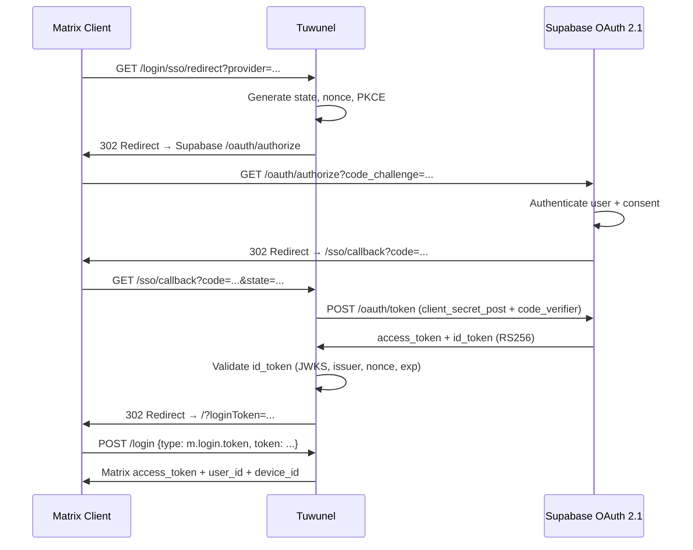
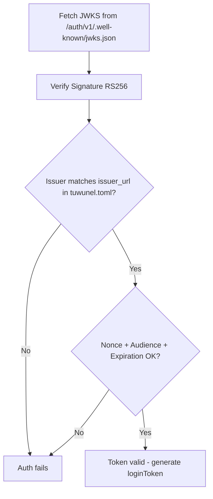
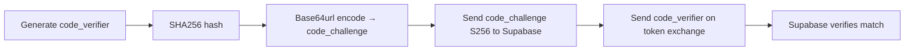

# Matrix SSO Flow (Tuwunel + Supabase OAuth 2.1)

This document explains how the Single Sign-On (SSO) flow works between:

- Matrix Client
- Tuwunel (Matrix homeserver)
- Supabase (OAuth 2.1 / OpenID Connect provider)

Understanding this flow is essential for debugging authentication issues.

---

# High-Level Architecture



---

# Step-by-Step Flow

---

## 1. Client Requests SSO Login

The Matrix client calls:

```
GET /_matrix/client/v3/login/sso/redirect?provider=<CLIENT_ID>&redirectUrl=<CLIENT_URL>
```

Tuwunel generates and stores internally:

- `state`
- `nonce`
- PKCE `code_verifier` + `code_challenge`

---

## 2. Redirect to Supabase Authorization Endpoint

Tuwunel redirects the user to `/auth/v1/oauth/authorize` with:

```
client_id
response_type=code
scope=openid email profile
redirect_uri
state
nonce
code_challenge
code_challenge_method=S256
```

---

## 3. User Authenticates in Supabase

Supabase authenticates the user and shows a consent screen if required. On success, redirects back to:

```
http://localhost:8008/_matrix/client/unstable/login/sso/callback/<CLIENT_ID>?code=...&state=...
```

---

## 4. Tuwunel Exchanges Code for Tokens

Tuwunel sends a `POST /auth/v1/oauth/token` with:

- `grant_type=authorization_code`
- `code`
- `redirect_uri`
- `code_verifier`
- Authentication via `client_secret_post`

> [!WARNING]
> The OAuth client in Supabase must be registered with `token_endpoint_auth_method = client_secret_post`, otherwise the token exchange will fail with:
>
> ```
> 400 invalid authentication method
> ```

---

## 5. Supabase Returns Tokens

Supabase returns:

- `access_token`
- `refresh_token`
- `id_token` (signed RS256)

---

## 6. Tuwunel Validates ID Token



> [!WARNING]
> `issuer_url` in `tuwunel/tuwunel.toml` must match byte-for-byte the `issuer` field returned by `/.well-known/openid-configuration`. No mixing of `localhost`, `127.0.0.1`, `host.docker.internal`, or HTTP vs HTTPS.

---

## 7. Matrix Login Token

If validation succeeds, Tuwunel redirects the user to:

```
http://localhost:8008/?loginToken=<random_string>
```

---

## 8. Client Exchanges loginToken for Matrix Access Token

```
POST /_matrix/client/v3/login
{
  "type": "m.login.token",
  "token": "loginToken"
}
```

Tuwunel responds with `access_token`, `user_id`, and `device_id`. The user is now authenticated.

---

# PKCE Behavior

Supabase OAuth 2.1 requires PKCE. Tuwunel handles it automatically:



> [!NOTE]
> No manual configuration required. If PKCE is missing or mismatched, Supabase will return `400 invalid_grant`.

---

# Common Failure Points

## 1. Issuer Mismatch

```
Configured issuer_url does not match discovered issuer
```

Cause: `issuer_url` does not match discovery `issuer` — HTTP vs HTTPS mismatch, `localhost` vs `127.0.0.1`, or missing `/auth/v1`.

---

## 2. Wrong Token Authentication Method

```
invalid authentication method
```

The OAuth client must be registered with `client_secret_post`, not `client_secret_basic`.

---

## 3. Invalid Redirect URI

```
400 invalid_redirect_uri
```

The redirect URI must match exactly what is registered in Supabase and configured in `tuwunel/tuwunel.toml`.

---

## 4. Discovery Fails

```
Request error sending request to /.well-known/openid-configuration
```

Check that Supabase is running (`supabase status`) and verify manually:

```bash
curl http://127.0.0.1:54321/auth/v1/.well-known/openid-configuration
```

In production, replace with your Supabase Cloud URL:

```bash
curl https://<project-ref>.supabase.co/auth/v1/.well-known/openid-configuration
```

---

# Debugging Checklist

Before testing SSO:

- [ ] Supabase running (`supabase status`)
- [ ] OAuth server enabled
- [ ] RS256 signing configured
- [ ] Discovery endpoint reachable (`curl http://127.0.0.1:54321/auth/v1/.well-known/openid-configuration`)
- [ ] `issuer_url` in `tuwunel/tuwunel.toml` matches discovery `issuer` exactly
- [ ] OAuth client uses `client_secret_post`
- [ ] Redirect URI matches exactly
